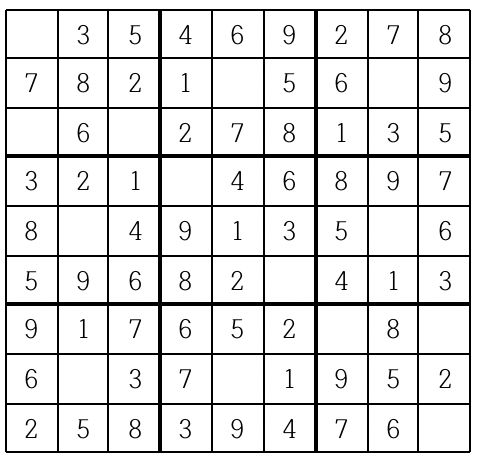
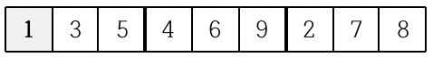
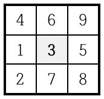
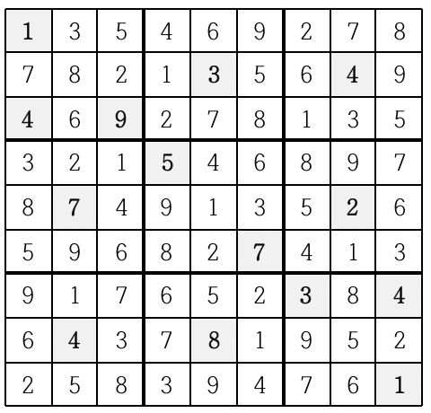

# [Unknown] 2580

## 📊 문제 정보
| 항목 | 내용 |
| :--- | :--- |
| 티어 | Unknown |
| 시간 제한 | 1 초 |
| 메모리 제한 | 256 MB |
| 알고리즘 | 등록된 분류가 없습니다. |
| 링크 | [백준 바로가기](https://www.acmicpc.net/problem/2580) |

---

## 📜 문제 설명

<p>스도쿠는 18세기 스위스 수학자가 만든 '라틴 사각형'이랑 퍼즐에서 유래한 것으로 현재 많은 인기를 누리고 있다. 이 게임은 아래 그림과 같이 가로, 세로 각각 9개씩 총 81개의 작은 칸으로 이루어진 정사각형 판 위에서 이뤄지는데, 게임 시작 전 일부 칸에는 1부터 9까지의 숫자 중 하나가 쓰여 있다.</p>

<p style="text-align: center;"></p>

<p>나머지 빈 칸을 채우는 방식은 다음과 같다.</p>

<ol>
	<li>각각의 가로줄과 세로줄에는 1부터 9까지의 숫자가 한 번씩만 나타나야 한다.</li>
	<li>굵은 선으로 구분되어 있는 3x3 정사각형 안에도 1부터 9까지의 숫자가 한 번씩만 나타나야 한다.</li>
</ol>

<p>위의 예의 경우, 첫째 줄에는 1을 제외한 나머지 2부터 9까지의 숫자들이 이미 나타나 있으므로 첫째 줄 빈칸에는 1이 들어가야 한다.</p>

<p style="text-align: center;"></p>

<p>또한 위쪽 가운데 위치한 3x3 정사각형의 경우에는 3을 제외한 나머지 숫자들이 이미 쓰여있으므로 가운데 빈 칸에는 3이 들어가야 한다.</p>

<p style="text-align: center;"></p>

<p>이와 같이 빈 칸을 차례로 채워 가면 다음과 같은 최종 결과를 얻을 수 있다.</p>

<p style="text-align: center;"></p>

<p>게임 시작 전 스도쿠 판에 쓰여 있는 숫자들의 정보가 주어질 때 모든 빈 칸이 채워진 최종 모습을 출력하는 프로그램을 작성하시오.</p>

### 📥 입력

<p>아홉 줄에 걸쳐 한 줄에 9개씩 게임 시작 전 스도쿠판 각 줄에 쓰여 있는 숫자가 한 칸씩 띄워서 차례로 주어진다. 스도쿠 판의 빈 칸의 경우에는 0이 주어진다. 스도쿠 판을 규칙대로 채울 수 없는 경우의 입력은 주어지지 않는다.</p>

### 📤 출력

<p>모든 빈 칸이 채워진 스도쿠 판의 최종 모습을 아홉 줄에 걸쳐 한 줄에 9개씩 한 칸씩 띄워서 출력한다.</p>

<p>스도쿠 판을 채우는 방법이 여럿인 경우는 그 중 하나만을 출력한다.</p>

---

## 💡 예제

### 예제 1
**Input:**
```text
0 3 5 4 6 9 2 7 8
7 8 2 1 0 5 6 0 9
0 6 0 2 7 8 1 3 5
3 2 1 0 4 6 8 9 7
8 0 4 9 1 3 5 0 6
5 9 6 8 2 0 4 1 3
9 1 7 6 5 2 0 8 0
6 0 3 7 0 1 9 5 2
2 5 8 3 9 4 7 6 0
```
**Output:**
```text
1 3 5 4 6 9 2 7 8
7 8 2 1 3 5 6 4 9
4 6 9 2 7 8 1 3 5
3 2 1 5 4 6 8 9 7
8 7 4 9 1 3 5 2 6
5 9 6 8 2 7 4 1 3
9 1 7 6 5 2 3 8 4
6 4 3 7 8 1 9 5 2
2 5 8 3 9 4 7 6 1
```

---

## 📜 나의 제출 기록

| 제출 번호 | 결과 | 메모리 | 시간 | 언어 | 제출 일자 |
| :--- | :--- | :--- | :--- | :--- | :--- |
| 102812791 | ✅ 맞았습니다!! | 12804 KB | 144 ms | Java 8 / 수정 | 2026년 2월 10일 |
| 102812753 | ❌ 틀렸습니다 | - KB | - ms | Java 8 / 수정 | 2026년 2월 10일 |
| 102812502 | ✅ 맞았습니다!! | 14140 KB | 208 ms | Java 8 / 수정 | 2026년 2월 10일 |

---

## 🖼️ 이미지









