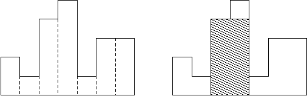

# [Unknown] 6549

## 📊 문제 정보
| 항목 | 내용 |
| :--- | :--- |
| 티어 | Unknown |
| 시간 제한 | 1 초 |
| 메모리 제한 | 256 MB |
| 알고리즘 | 등록된 분류가 없습니다. |
| 링크 | [백준 바로가기](https://www.acmicpc.net/problem/6549) |

---

## 📜 문제 설명

<p>히스토그램은 직사각형 여러 개가 아래쪽으로 정렬되어 있는 도형이다. 각 직사각형은 같은 너비를 가지고 있지만, 높이는 서로 다를 수도 있다. 예를 들어, 왼쪽 그림은 높이가 2, 1, 4, 5, 1, 3, 3이고 너비가 1인 직사각형으로 이루어진 히스토그램이다.</p>

<p style="text-align: center;"></p>

<p>히스토그램에서 가장 넓이가 큰 직사각형을 구하는 프로그램을 작성하시오.</p>

### 📥 입력

<p>입력은 테스트 케이스 여러 개로 이루어져 있다. 각 테스트 케이스는 한 줄로 이루어져 있고, 직사각형의 수 n이 가장 처음으로 주어진다. (1 ≤ n ≤ 100,000) 그 다음 n개의 정수 h<sub>1</sub>, ..., h<sub>n</sub> (0 ≤ h<sub>i</sub> ≤ 1,000,000,000)가 주어진다. 이 숫자들은 히스토그램에 있는 직사각형의 높이이며, 왼쪽부터 오른쪽까지 순서대로 주어진다. 모든 직사각형의 너비는 1이고, 입력의 마지막 줄에는 0이 하나 주어진다.</p>

### 📤 출력

<p>각 테스트 케이스에 대해서, 히스토그램에서 가장 넓이가 큰 직사각형의 넓이를 출력한다.</p>

---

## 💡 예제

### 예제 1
**Input:**
```text
7 2 1 4 5 1 3 3
4 1000 1000 1000 1000
0
```
**Output:**
```text
8
4000
```

---

## 📜 나의 제출 기록

| 제출 번호 | 결과 | 메모리 | 시간 | 언어 | 제출 일자 |
| :--- | :--- | :--- | :--- | :--- | :--- |
| 103267258 | ✅ 맞았습니다!! | 12968 KB | 152 ms | Java 8 / 수정 | 2026년 2월 25일 |

---

## 🖼️ 이미지



