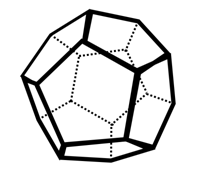

# [다면체] 10569

## 📊 문제 정보
| 항목 | 내용 |
| :--- | :--- |
| 티어 | Bronze IV |
| 시간 제한 | 5 초 |
| 메모리 제한 | 256 MB |
| 알고리즘 | 수학, 기하학, 사칙연산, 오일러 지표 (χ=V-E+F) |
| 링크 | [백준 바로가기](https://www.acmicpc.net/problem/10569) |

---

## 📜 문제 설명

<p style="text-align:center"></p>

<p>수학자가 구를 깎아서 볼록다면체를 만들었다. 이 수학자는 임의의 볼록다면체에 대해 (꼭짓점의 수) - (모서리의 수) + (면의 수) = 2가 성립한다는 것을 알고 있다. 그래서 구를 깎는 게 취미인 이 사람은 꼭짓점, 모서리와 면의 수를 기록할 때 꼭짓점과 모서리의 수만 세고 면의 수는 세지 않는다.</p>

### 📥 입력

<p>첫 번째 줄에 1 이상 100 이하의 자연수 T가 주어진다.</p>

<p>다음 T개의 줄에 4 이상 100 이하의 자연수 V와 E가 공백을 사이에 두고 주어진다. V와 E는 각각 꼭짓점의 개수와 모서리의 개수이다.</p>

### 📤 출력

<p>각 V와 E에 대해 볼록다면체의 면의 수를 한 줄에 하나씩 출력한다.</p>

---

## 💡 예제

### 예제 1
**Input:**
```text
2
8 12
4 6
```
**Output:**
```text
6
4
```

---

## 📜 나의 제출 기록

| 제출 번호 | 결과 | 메모리 | 시간 | 언어 | 제출 일자 |
| :--- | :--- | :--- | :--- | :--- | :--- |
| 103164831 | ✅ 맞았습니다!! | 11416 KB | 56 ms | Java 8 / 수정 | 2026년 2월 21일 |

---

## 🖼️ 이미지



