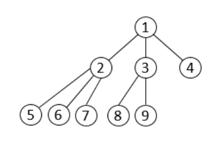

# [K진 트리] 11812

## 📊 문제 정보
| 항목 | 내용 |
| :--- | :--- |
| 티어 | Gold III |
| 시간 제한 | 1 초 |
| 메모리 제한 | 256 MB |
| 알고리즘 | 수학, 트리, 최소 공통 조상 |
| 링크 | [백준 바로가기](https://www.acmicpc.net/problem/11812) |

---

## 📜 문제 설명

<p>각 노드가 자식을 최대 K개 가질 수 있는 트리를 K진 트리라고 한다. 총 N개의 노드로 이루어져 있는 K진 트리가 주어진다.</p>

<p>트리는 "적은 에너지" 방법을 이용해서 만든다. "적은 에너지" 방법이란, 이전 깊이를 모두 채운 경우에만, 새로운 깊이를 만드는 것이고, 이 새로운 깊이의 노드는 가장 왼쪽부터 차례대로 추가 한다.</p>

<p>아래 그림은 노드 9개로 이루어져 있는 3진 트리이다.</p>

<p style="text-align:center"></p>

<p>노드의 개수 N과 K가 주어졌을 때, 두 노드 x와&nbsp;y 사이의 거리를 구하는 프로그램을 작성하시오.</p>

### 📥 입력

<p>첫째 줄에 N (1 ≤&nbsp;N ≤ 10<sup>15</sup>)과 K (1 ≤ K ≤ 1 000), 그리고 거리를 구해야 하는 노드 쌍의 개수 Q (1 ≤ Q ≤ 100 000)가 주어진다.</p>

<p>다음 Q개 줄에는 거리를 구해야 하는 두 노드 x와 y가 주어진다. (1 ≤ x, y ≤ N, x ≠ y)</p>

### 📤 출력

<p>총 Q개의 줄을 출력한다. 각 줄에는 입력으로 주어진 두 노드 사이의 거리를 출력한다.</p>

---

## 💡 예제

### 예제 1
**Input:**
```text
7 2 3
1 2
2 1
4 7
```
**Output:**
```text
1
1
4
```

### 예제 2
**Input:**
```text
9 3 3
8 9
5 7
8 4
```
**Output:**
```text
2
2
3
```

---

## 📜 나의 제출 기록

| 제출 번호 | 결과 | 메모리 | 시간 | 언어 | 제출 일자 |
| :--- | :--- | :--- | :--- | :--- | :--- |
| 102958002 | ✅ 맞았습니다!! | 15452 KB | 192 ms | Java 8 / 수정 | 2026년 2월 14일 |

---

## 🖼️ 이미지



