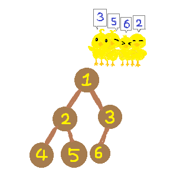

# [Unknown] 20364

## 📊 문제 정보
| 항목 | 내용 |
| :--- | :--- |
| 티어 | Unknown |
| 시간 제한 | 2 초 |
| 메모리 제한 | 1024 MB |
| 알고리즘 | 등록된 분류가 없습니다. |
| 링크 | [백준 바로가기](https://www.acmicpc.net/problem/20364) |

---

## 📜 문제 설명

<p>이진 트리 모양의 땅으로 이루어진 꽉꽉마을에는 오리들이 살고 있다. 땅 번호는 다음과 같이 매겨진다.</p>

<ol>
	<li>루트 땅의 번호는 1이다.</li>
	<li>어떤 땅의 번호가 <em>K</em>라면, 왼쪽 자식 땅의 번호는 2 ×&nbsp;<em>K</em>, 오른쪽 자식 땅의 번호는 2 ×&nbsp;<em>K&nbsp;</em>+&nbsp;1이다.</li>
</ol>

<p>어느날 오리들끼리 부동산 다툼이 일어나서 꽉꽉마을 촌장 경완이가&nbsp;해결책을 가져왔고, 그 내용은 다음과 같다.</p>

<ol>
	<li>오리들을 한 줄로 대기시킨다. 맨 처음 오리들은 1번 땅에 위치해 있다.</li>
	<li>오리들이 서있는 순서대로 원하는 땅을 가지도록 한다.</li>
</ol>

<p style="text-align: center;"></p>

<p>만약, 한 오리가 원하는 땅까지 가는 길에 이미 다른 오리가 점유한&nbsp;땅이 있다면 막대한 세금을 내야 하는 이유로 해당 땅을 지나가지 못해 그 오리는 땅을 가지지 못한다. 오리가 원하는 땅까지 가는 길에는 오리가 원하는 땅도 포함된다.</p>

<ol>
</ol>

<p>경완이의 해결책대로 땅 분배를 했을 때 각 오리별로 원하는 땅을 가질 수 있는지, 가질 수 없다면 처음 마주치는 점유된 땅의 번호를 구해보자.</p>

### 📥 입력

<p>첫 번째 줄에 땅 개수&nbsp;<em>N</em>과 꽉꽉나라에 사는 오리 수&nbsp;<em>Q</em>가 공백으로 구분되어 주어진다.&nbsp;(2 ≤&nbsp;<em>N</em>&nbsp;&lt;&nbsp;2<sup>20</sup>, 1 ≤ <em>Q</em> ≤ 200,000)</p>

<p>두 번째 줄부터 차례로 <em>Q</em>개의 줄에 걸쳐 <em>i</em>+1번째 줄에는&nbsp;<em>i</em>번째 오리가 원하는 땅 번호 <em>x<sub>i</sub></em>가 주어진다. (2 ≤ <em>x<sub>i</sub></em>&nbsp;≤ <em>N</em>)</p>

### 📤 출력

<p><em>Q</em>개의 줄에 원하는 땅에 갈 수 있다면 0을, 갈 수 없다면 처음 마주치는 점유된 땅의 번호를&nbsp;출력한다.</p>

---

## 💡 예제

### 예제 1
**Input:**
```text
6 4
3
5
6
2
```
**Output:**
```text
0
0
3
0
```

---

## 📜 나의 제출 기록

| 제출 번호 | 결과 | 메모리 | 시간 | 언어 | 제출 일자 |
| :--- | :--- | :--- | :--- | :--- | :--- |
| 102582863 | ✅ 맞았습니다!! | 24804 KB | 224 ms | Java 8 / 수정 | 2026년 2월 3일 |
| 102573025 | ✅ 맞았습니다!! | 24848 KB | 228 ms | Java 8 / 수정 | 2026년 2월 3일 |
| 102572969 | ✅ 맞았습니다!! | 24944 KB | 228 ms | Java 8 / 수정 | 2026년 2월 3일 |

---

## 🖼️ 이미지



