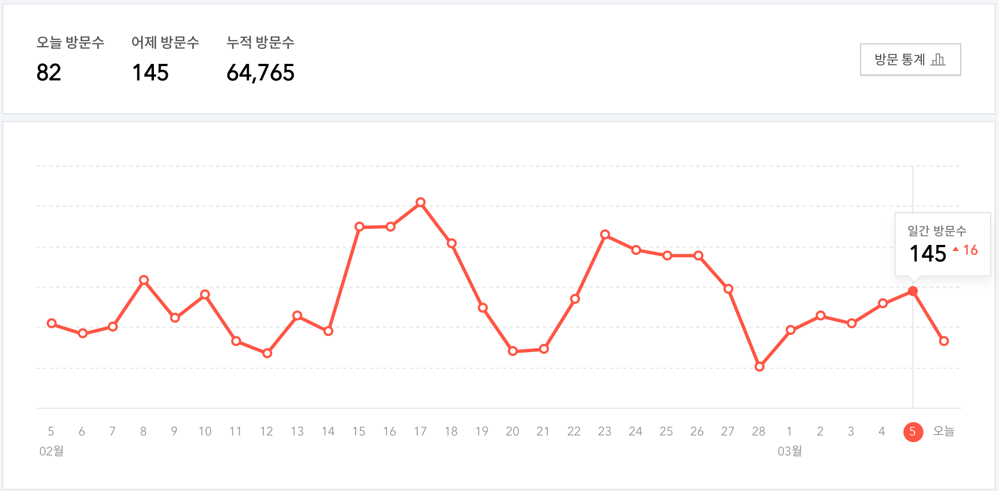

# [블로그] 21921

## 📊 문제 정보
| 항목 | 내용 |
| :--- | :--- |
| 티어 | Silver III |
| 시간 제한 | 1 초 |
| 메모리 제한 | 512 MB |
| 알고리즘 | 누적 합, 슬라이딩 윈도우 |
| 링크 | [백준 바로가기](https://www.acmicpc.net/problem/21921) |

---

## 📜 문제 설명

<p>찬솔이는 블로그를 시작한 지 벌써 <mjx-container class="MathJax" jax="CHTML" style="font-size: 109%; position: relative;"><mjx-math class="MJX-TEX" aria-hidden="true"><mjx-mi class="mjx-i"><mjx-c class="mjx-c1D441 TEX-I"></mjx-c></mjx-mi></mjx-math><mjx-assistive-mml unselectable="on" display="inline"><math xmlns="http://www.w3.org/1998/Math/MathML"><mi>N</mi></math></mjx-assistive-mml><span aria-hidden="true" class="no-mathjax mjx-copytext">$N$</span></mjx-container>일이 지났다.</p>

<p>요즘 바빠서 관리를 못 했다가 방문 기록을 봤더니 벌써 누적 방문 수가 6만을 넘었다.</p>

<p style="text-align: center;"></p>

<p>찬솔이는 <mjx-container class="MathJax" jax="CHTML" style="font-size: 109%; position: relative;"><mjx-math class="MJX-TEX" aria-hidden="true"><mjx-mi class="mjx-i"><mjx-c class="mjx-c1D44B TEX-I"></mjx-c></mjx-mi></mjx-math><mjx-assistive-mml unselectable="on" display="inline"><math xmlns="http://www.w3.org/1998/Math/MathML"><mi>X</mi></math></mjx-assistive-mml><span aria-hidden="true" class="no-mathjax mjx-copytext">$X$</span></mjx-container>일 동안 가장 많이 들어온 방문자 수와 그 기간들을 알고 싶다.</p>

<p>찬솔이를 대신해서 <mjx-container class="MathJax" jax="CHTML" style="font-size: 109%; position: relative;"><mjx-math class="MJX-TEX" aria-hidden="true"><mjx-mi class="mjx-i"><mjx-c class="mjx-c1D44B TEX-I"></mjx-c></mjx-mi></mjx-math><mjx-assistive-mml unselectable="on" display="inline"><math xmlns="http://www.w3.org/1998/Math/MathML"><mi>X</mi></math></mjx-assistive-mml><span aria-hidden="true" class="no-mathjax mjx-copytext">$X$</span></mjx-container>일 동안 가장 많이 들어온 방문자 수와 기간이 몇 개 있는지 구해주자.</p>

### 📥 입력

<p>첫째 줄에 블로그를 시작하고 지난 일수 <mjx-container class="MathJax" jax="CHTML" style="font-size: 109%; position: relative;"><mjx-math class="MJX-TEX" aria-hidden="true"><mjx-mi class="mjx-i"><mjx-c class="mjx-c1D441 TEX-I"></mjx-c></mjx-mi></mjx-math><mjx-assistive-mml unselectable="on" display="inline"><math xmlns="http://www.w3.org/1998/Math/MathML"><mi>N</mi></math></mjx-assistive-mml><span aria-hidden="true" class="no-mathjax mjx-copytext">$N$</span></mjx-container>와 <mjx-container class="MathJax" jax="CHTML" style="font-size: 109%; position: relative;"><mjx-math class="MJX-TEX" aria-hidden="true"><mjx-mi class="mjx-i"><mjx-c class="mjx-c1D44B TEX-I"></mjx-c></mjx-mi></mjx-math><mjx-assistive-mml unselectable="on" display="inline"><math xmlns="http://www.w3.org/1998/Math/MathML"><mi>X</mi></math></mjx-assistive-mml><span aria-hidden="true" class="no-mathjax mjx-copytext">$X$</span></mjx-container>가 공백으로 구분되어 주어진다.</p>

<p>둘째 줄에는 블로그 시작 <mjx-container class="MathJax" jax="CHTML" style="font-size: 109%; position: relative;"><mjx-math class="MJX-TEX" aria-hidden="true"><mjx-mn class="mjx-n"><mjx-c class="mjx-c31"></mjx-c></mjx-mn></mjx-math><mjx-assistive-mml unselectable="on" display="inline"><math xmlns="http://www.w3.org/1998/Math/MathML"><mn>1</mn></math></mjx-assistive-mml><span aria-hidden="true" class="no-mathjax mjx-copytext">$1$</span></mjx-container>일차부터 <mjx-container class="MathJax" jax="CHTML" style="font-size: 109%; position: relative;"><mjx-math class="MJX-TEX" aria-hidden="true"><mjx-mi class="mjx-i"><mjx-c class="mjx-c1D441 TEX-I"></mjx-c></mjx-mi></mjx-math><mjx-assistive-mml unselectable="on" display="inline"><math xmlns="http://www.w3.org/1998/Math/MathML"><mi>N</mi></math></mjx-assistive-mml><span aria-hidden="true" class="no-mathjax mjx-copytext">$N$</span></mjx-container>일차까지 하루 방문자 수가 공백으로 구분되어 주어진다.</p>

### 📤 출력

<p>첫째 줄에 <mjx-container class="MathJax" jax="CHTML" style="font-size: 109%; position: relative;"><mjx-math class="MJX-TEX" aria-hidden="true"><mjx-mi class="mjx-i"><mjx-c class="mjx-c1D44B TEX-I"></mjx-c></mjx-mi></mjx-math><mjx-assistive-mml unselectable="on" display="inline"><math xmlns="http://www.w3.org/1998/Math/MathML"><mi>X</mi></math></mjx-assistive-mml><span aria-hidden="true" class="no-mathjax mjx-copytext">$X$</span></mjx-container>일 동안 가장 많이 들어온 방문자 수를 출력한다. 만약 최대 방문자 수가 0명이라면 <strong>SAD</strong>를 출력한다.</p>

<p>만약 최대 방문자 수가 0명이 아닌 경우 둘째 줄에 기간이 몇 개 있는지 출력한다.</p>

---

## 💡 예제

### 예제 1
**Input:**
```text
5 2
1 4 2 5 1
```
**Output:**
```text
7
1
```

### 예제 2
**Input:**
```text
7 5
1 1 1 1 1 5 1
```
**Output:**
```text
9
2
```

### 예제 3
**Input:**
```text
5 3
0 0 0 0 0
```
**Output:**
```text
SAD
```

---

## 📜 나의 제출 기록

| 제출 번호 | 결과 | 메모리 | 시간 | 언어 | 제출 일자 |
| :--- | :--- | :--- | :--- | :--- | :--- |
| 102545740 | ✅ 맞았습니다!! | 12880 KB | 108 ms | Java 8 / 수정 | 2026년 2월 2일 |

---

## 🖼️ 이미지



