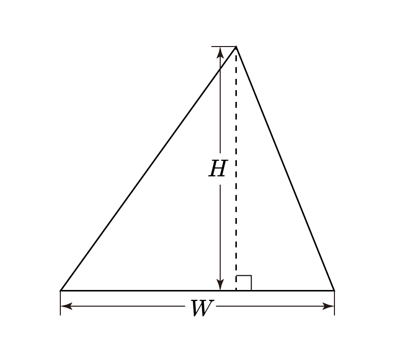

# [삼각형] 29751

## 📊 문제 정보
| 항목 | 내용 |
| :--- | :--- |
| 티어 | Bronze V |
| 시간 제한 | 0.1 초 |
| 메모리 제한 | 1024 MB |
| 알고리즘 | 수학, 기하학, 사칙연산 |
| 링크 | [백준 바로가기](https://www.acmicpc.net/problem/29751) |

---

## 📜 문제 설명

<p>양의 정수 <mjx-container class="MathJax" jax="CHTML" style="font-size: 109%; position: relative;"><mjx-math class="MJX-TEX" aria-hidden="true"><mjx-mi class="mjx-i"><mjx-c class="mjx-c1D44A TEX-I"></mjx-c></mjx-mi></mjx-math><mjx-assistive-mml unselectable="on" display="inline"><math xmlns="http://www.w3.org/1998/Math/MathML"><mi>W</mi></math></mjx-assistive-mml><span aria-hidden="true" class="no-mathjax mjx-copytext">$W$</span></mjx-container>, <mjx-container class="MathJax" jax="CHTML" style="font-size: 109%; position: relative;"><mjx-math class="MJX-TEX" aria-hidden="true"><mjx-mi class="mjx-i"><mjx-c class="mjx-c1D43B TEX-I"></mjx-c></mjx-mi></mjx-math><mjx-assistive-mml unselectable="on" display="inline"><math xmlns="http://www.w3.org/1998/Math/MathML"><mi>H</mi></math></mjx-assistive-mml><span aria-hidden="true" class="no-mathjax mjx-copytext">$H$</span></mjx-container>가 주어진다. 밑변의 길이가 <mjx-container class="MathJax" jax="CHTML" style="font-size: 109%; position: relative;"><mjx-math class="MJX-TEX" aria-hidden="true"><mjx-mi class="mjx-i"><mjx-c class="mjx-c1D44A TEX-I"></mjx-c></mjx-mi></mjx-math><mjx-assistive-mml unselectable="on" display="inline"><math xmlns="http://www.w3.org/1998/Math/MathML"><mi>W</mi></math></mjx-assistive-mml><span aria-hidden="true" class="no-mathjax mjx-copytext">$W$</span></mjx-container>이고, 높이가 <mjx-container class="MathJax" jax="CHTML" style="font-size: 109%; position: relative;"><mjx-math class="MJX-TEX" aria-hidden="true"><mjx-mi class="mjx-i"><mjx-c class="mjx-c1D43B TEX-I"></mjx-c></mjx-mi></mjx-math><mjx-assistive-mml unselectable="on" display="inline"><math xmlns="http://www.w3.org/1998/Math/MathML"><mi>H</mi></math></mjx-assistive-mml><span aria-hidden="true" class="no-mathjax mjx-copytext">$H$</span></mjx-container>인 삼각형의 넓이를 구하시오.</p>

<p style="text-align:center;max-width:500px; margin: 0 auto"></p>

### 📥 입력

<p>정수 <mjx-container class="MathJax" jax="CHTML" style="font-size: 109%; position: relative;"><mjx-math class="MJX-TEX" aria-hidden="true"><mjx-mi class="mjx-i"><mjx-c class="mjx-c1D44A TEX-I"></mjx-c></mjx-mi></mjx-math><mjx-assistive-mml unselectable="on" display="inline"><math xmlns="http://www.w3.org/1998/Math/MathML"><mi>W</mi></math></mjx-assistive-mml><span aria-hidden="true" class="no-mathjax mjx-copytext">$W$</span></mjx-container>, <mjx-container class="MathJax" jax="CHTML" style="font-size: 109%; position: relative;"><mjx-math class="MJX-TEX" aria-hidden="true"><mjx-mi class="mjx-i"><mjx-c class="mjx-c1D43B TEX-I"></mjx-c></mjx-mi></mjx-math><mjx-assistive-mml unselectable="on" display="inline"><math xmlns="http://www.w3.org/1998/Math/MathML"><mi>H</mi></math></mjx-assistive-mml><span aria-hidden="true" class="no-mathjax mjx-copytext">$H$</span></mjx-container>가 공백으로 구분되어 주어진다. <mjx-container class="MathJax" jax="CHTML" style="font-size: 109%; position: relative;"><mjx-math class="MJX-TEX" aria-hidden="true"><mjx-mo class="mjx-n"><mjx-c class="mjx-c28"></mjx-c></mjx-mo><mjx-mn class="mjx-n"><mjx-c class="mjx-c31"></mjx-c></mjx-mn><mjx-mo class="mjx-n" space="4"><mjx-c class="mjx-c2264"></mjx-c></mjx-mo><mjx-mi class="mjx-i" space="4"><mjx-c class="mjx-c1D44A TEX-I"></mjx-c></mjx-mi><mjx-mo class="mjx-n"><mjx-c class="mjx-c2C"></mjx-c></mjx-mo><mjx-mi class="mjx-i" space="2"><mjx-c class="mjx-c1D43B TEX-I"></mjx-c></mjx-mi><mjx-mo class="mjx-n" space="4"><mjx-c class="mjx-c2264"></mjx-c></mjx-mo><mjx-mn class="mjx-n" space="4"><mjx-c class="mjx-c31"></mjx-c><mjx-c class="mjx-c30"></mjx-c><mjx-c class="mjx-c30"></mjx-c></mjx-mn><mjx-mo class="mjx-n"><mjx-c class="mjx-c29"></mjx-c></mjx-mo></mjx-math><mjx-assistive-mml unselectable="on" display="inline"><math xmlns="http://www.w3.org/1998/Math/MathML"><mo stretchy="false">(</mo><mn>1</mn><mo>≤</mo><mi>W</mi><mo>,</mo><mi>H</mi><mo>≤</mo><mn>100</mn><mo stretchy="false">)</mo></math></mjx-assistive-mml><span aria-hidden="true" class="no-mathjax mjx-copytext">$(1 \le W, H \le 100)$</span> </mjx-container></p>

### 📤 출력

<p>밑변의 길이가 <mjx-container class="MathJax" jax="CHTML" style="font-size: 109%; position: relative;"><mjx-math class="MJX-TEX" aria-hidden="true"><mjx-mi class="mjx-i"><mjx-c class="mjx-c1D44A TEX-I"></mjx-c></mjx-mi></mjx-math><mjx-assistive-mml unselectable="on" display="inline"><math xmlns="http://www.w3.org/1998/Math/MathML"><mi>W</mi></math></mjx-assistive-mml><span aria-hidden="true" class="no-mathjax mjx-copytext">$W$</span></mjx-container>이고, 높이가 <mjx-container class="MathJax" jax="CHTML" style="font-size: 109%; position: relative;"><mjx-math class="MJX-TEX" aria-hidden="true"><mjx-mi class="mjx-i"><mjx-c class="mjx-c1D43B TEX-I"></mjx-c></mjx-mi></mjx-math><mjx-assistive-mml unselectable="on" display="inline"><math xmlns="http://www.w3.org/1998/Math/MathML"><mi>H</mi></math></mjx-assistive-mml><span aria-hidden="true" class="no-mathjax mjx-copytext">$H$</span></mjx-container>인 삼각형의 넓이를 출력한다. <strong>넓이는 항상 소수점 아래 첫 번째 자리까지 출력한다.</strong></p>

---

## 💡 예제

### 예제 1
**Input:**
```text
1 1
```
**Output:**
```text
0.5
```

### 예제 2
**Input:**
```text
2 3
```
**Output:**
```text
3.0
```

---

## 📜 나의 제출 기록

| 제출 번호 | 결과 | 메모리 | 시간 | 언어 | 제출 일자 |
| :--- | :--- | :--- | :--- | :--- | :--- |
| 103164997 | ✅ 맞았습니다!! | 11528 KB | 64 ms | Java 8 / 수정 | 2026년 2월 21일 |
| 103164967 | ✅ 맞았습니다!! | 11768 KB | 72 ms | Java 8 / 수정 | 2026년 2월 21일 |

---

## 🖼️ 이미지



