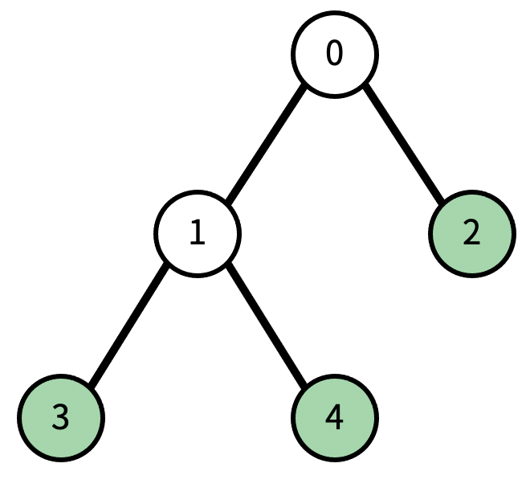
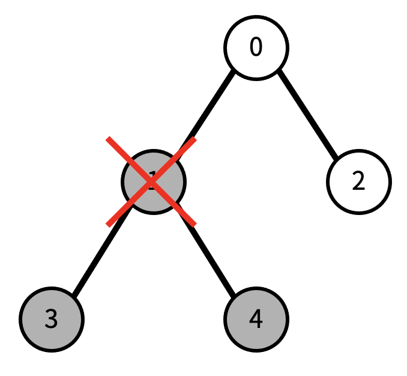

# [트리] 1068

## 📊 문제 정보
| 항목 | 내용 |
| :--- | :--- |
| 티어 | Gold V |
| 시간 제한 | 2 초 |
| 메모리 제한 | 128 MB |
| 알고리즘 |그래프 이론, 그래프 탐색, 트리, 깊이 우선 탐색 |
| 링크 | [백준 바로가기](https://www.acmicpc.net/problem/1068) |

---

## 📜 문제 설명

<p>트리에서 리프 노드란, 자식의 개수가 0인 노드를 말한다.</p>

<p>트리가 주어졌을 때, 노드 하나를 지울&nbsp;것이다. 그 때, 남은 트리에서 리프 노드의 개수를 구하는 프로그램을 작성하시오. 노드를 지우면 그 노드와 노드의 모든 자손이 트리에서 제거된다.</p>

<p>예를 들어, 다음과 같은 트리가 있다고 하자.</p>

<p style="text-align: center"></p>

<p>현재 리프 노드의 개수는 3개이다. (초록색 색칠된 노드) 이때, 1번을 지우면, 다음과 같이 변한다. 검정색으로 색칠된 노드가 트리에서 제거된 노드이다.</p>

<p style="text-align: center"></p>

<p>이제 리프 노드의 개수는 1개이다.</p>

### 📥 입력

<p>첫째 줄에 트리의 노드의 개수 N이 주어진다. N은 50보다 작거나 같은 자연수이다. 둘째 줄에는 0번 노드부터 N-1번 노드까지, 각 노드의 부모가 주어진다. 만약 부모가 없다면 (루트) -1이 주어진다. 셋째 줄에는 지울 노드의 번호가 주어진다.</p>

### 📤 출력

<p>첫째 줄에 입력으로 주어진 트리에서 입력으로 주어진 노드를 지웠을 때, 리프 노드의 개수를 출력한다.</p>

---

## 💡 예제

### 예제 1
**Input:**
```text
5
-1 0 0 1 1
2
```
**Output:**
```text
2
```

### 예제 2
**Input:**
```text
5
-1 0 0 1 1
1
```
**Output:**
```text
1
```

### 예제 3
**Input:**
```text
5
-1 0 0 1 1
0
```
**Output:**
```text
0
```

### 예제 4
**Input:**
```text
9
-1 0 0 2 2 4 4 6 6
4
```
**Output:**
```text
2
```

---

## 📜 나의 제출 기록

| 제출 번호 | 결과 | 메모리 | 시간 | 언어 | 제출 일자 |
| :--- | :--- | :--- | :--- | :--- | :--- |
| 103442772 | ✅ 맞았습니다!! | 11500 KB | 64 ms | Java 8 / 수정 | 2026년 3월 2일 |
| 103442755 | ❌ 틀렸습니다 | - KB | - ms | Java 8 / 수정 | 2026년 3월 2일 |
| 103441655 | ✅ 맞았습니다!! | 11496 KB | 68 ms | Java 8 / 수정 | 2026년 3월 2일 |

---

## 🖼️ 이미지





