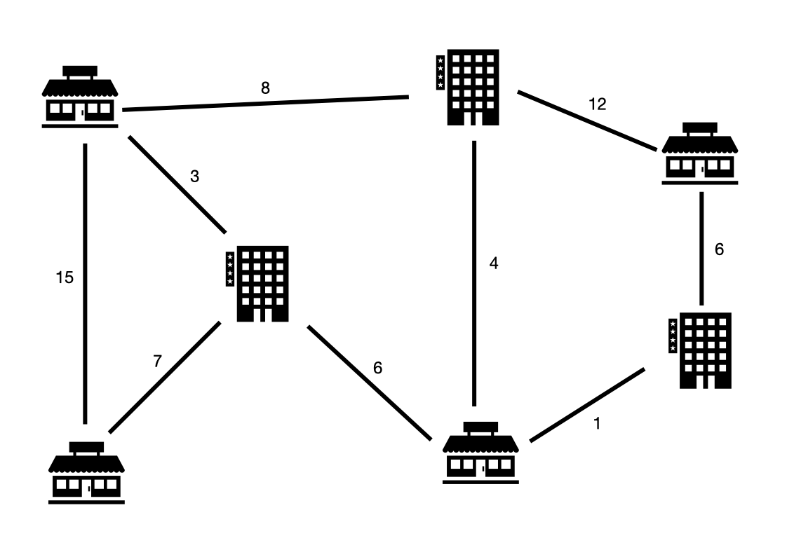
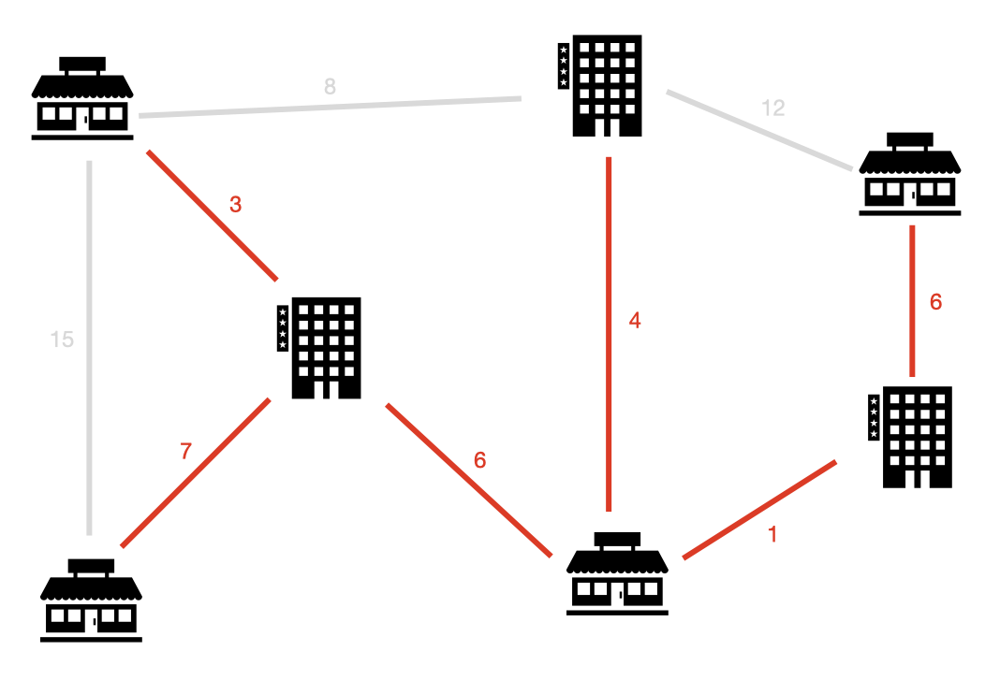

# [도시 건설] 21924

## 📊 문제 정보
| 항목 | 내용 |
| :--- | :--- |
| 티어 | Gold IV |
| 시간 제한 | 1 초 |
| 메모리 제한 | 512 MB |
| 알고리즘 | 그래프 이론, 최소 스패닝 트리 |
| 링크 | [백준 바로가기](https://www.acmicpc.net/problem/21924) |

---

## 📜 문제 설명

<p>채완이는 신도시에 건물 사이를 잇는 양방향 도로를 만들려는 공사&nbsp;계획을 세웠다.</p>

<p>공사 계획을 검토하면서 비용이 생각보다 많이 드는 것을 확인했다.</p>

<p>채완이는 공사하는 데 드는 비용을 아끼려고 한다.&nbsp;</p>

<p>모든 건물이 도로를 통해 연결되도록 최소한의 도로를 만들려고 한다.</p>

<p style="text-align: center;"></p>

<p>위 그림에서 건물과 직선으로 표시된 도로, 해당 도로를 만들 때 드는 비용을 표시해놓은 지도이다.</p>

<p style="text-align: center;"></p>

<p>그림에 있는 도로를 다 설치할 때 드는 비용은 62이다. 모든 건물을 연결하는 도로만&nbsp;만드는 비용은 27로 절약하는 비용은 35이다.</p>

<p>채완이는&nbsp;도로가 너무 많아 절약되는 금액을 계산하는 데 어려움을 겪고 있다.</p>

<p>채완이를 대신해&nbsp;얼마나 절약이 되는지 계산해주자.</p>

### 📥 입력

<p>첫 번째 줄에 건물의 개수 <mjx-container class="MathJax" jax="CHTML" style="font-size: 109%; position: relative;"><mjx-math class="MJX-TEX" aria-hidden="true"><mjx-mi class="mjx-i"><mjx-c class="mjx-c1D441 TEX-I"></mjx-c></mjx-mi></mjx-math><mjx-assistive-mml unselectable="on" display="inline"><math xmlns="http://www.w3.org/1998/Math/MathML"><mi>N</mi></math></mjx-assistive-mml><span aria-hidden="true" class="no-mathjax mjx-copytext">$N$</span></mjx-container> <mjx-container class="MathJax" jax="CHTML" style="font-size: 109%; position: relative;"><mjx-math class="MJX-TEX" aria-hidden="true"><mjx-mo class="mjx-n"><mjx-c class="mjx-c28"></mjx-c></mjx-mo><mjx-mn class="mjx-n"><mjx-c class="mjx-c33"></mjx-c></mjx-mn><mjx-mo class="mjx-n" space="4"><mjx-c class="mjx-c2264"></mjx-c></mjx-mo><mjx-mi class="mjx-i" space="4"><mjx-c class="mjx-c1D441 TEX-I"></mjx-c></mjx-mi><mjx-mo class="mjx-n" space="4"><mjx-c class="mjx-c2264"></mjx-c></mjx-mo><mjx-msup space="4"><mjx-mn class="mjx-n"><mjx-c class="mjx-c31"></mjx-c><mjx-c class="mjx-c30"></mjx-c></mjx-mn><mjx-script style="vertical-align: 0.393em;"><mjx-mn class="mjx-n" size="s"><mjx-c class="mjx-c35"></mjx-c></mjx-mn></mjx-script></mjx-msup><mjx-mo class="mjx-n"><mjx-c class="mjx-c29"></mjx-c></mjx-mo></mjx-math><mjx-assistive-mml unselectable="on" display="inline"><math xmlns="http://www.w3.org/1998/Math/MathML"><mo stretchy="false">(</mo><mn>3</mn><mo>≤</mo><mi>N</mi><mo>≤</mo><msup><mn>10</mn><mn>5</mn></msup><mo stretchy="false">)</mo></math></mjx-assistive-mml><span aria-hidden="true" class="no-mathjax mjx-copytext">$(3 \le N \le 10^5 )$</span></mjx-container>와 도로의 개수 <mjx-container class="MathJax" jax="CHTML" style="font-size: 109%; position: relative;"><mjx-math class="MJX-TEX" aria-hidden="true"><mjx-mi class="mjx-i"><mjx-c class="mjx-c1D440 TEX-I"></mjx-c></mjx-mi></mjx-math><mjx-assistive-mml unselectable="on" display="inline"><math xmlns="http://www.w3.org/1998/Math/MathML"><mi>M</mi></math></mjx-assistive-mml><span aria-hidden="true" class="no-mathjax mjx-copytext">$M$</span></mjx-container> <mjx-container class="MathJax" jax="CHTML" style="font-size: 109%; position: relative;"><mjx-math class="MJX-TEX" aria-hidden="true"><mjx-mo class="mjx-n"><mjx-c class="mjx-c28"></mjx-c></mjx-mo><mjx-mn class="mjx-n"><mjx-c class="mjx-c32"></mjx-c></mjx-mn><mjx-mo class="mjx-n" space="4"><mjx-c class="mjx-c2264"></mjx-c></mjx-mo><mjx-mi class="mjx-i" space="4"><mjx-c class="mjx-c1D440 TEX-I"></mjx-c></mjx-mi><mjx-mo class="mjx-n" space="4"><mjx-c class="mjx-c2264"></mjx-c></mjx-mo><mjx-mi class="mjx-i" space="4"><mjx-c class="mjx-c1D45A TEX-I"></mjx-c></mjx-mi><mjx-mi class="mjx-i"><mjx-c class="mjx-c1D456 TEX-I"></mjx-c></mjx-mi><mjx-mi class="mjx-i"><mjx-c class="mjx-c1D45B TEX-I"></mjx-c></mjx-mi><mjx-mo class="mjx-n"><mjx-c class="mjx-c28"></mjx-c></mjx-mo><mjx-texatom texclass="ORD"><mjx-mfrac><mjx-frac><mjx-num><mjx-nstrut></mjx-nstrut><mjx-mrow size="s"><mjx-mi class="mjx-i"><mjx-c class="mjx-c1D441 TEX-I"></mjx-c></mjx-mi><mjx-mo class="mjx-n"><mjx-c class="mjx-c28"></mjx-c></mjx-mo><mjx-mi class="mjx-i"><mjx-c class="mjx-c1D441 TEX-I"></mjx-c></mjx-mi><mjx-mo class="mjx-n"><mjx-c class="mjx-c2212"></mjx-c></mjx-mo><mjx-mn class="mjx-n"><mjx-c class="mjx-c31"></mjx-c></mjx-mn><mjx-mo class="mjx-n"><mjx-c class="mjx-c29"></mjx-c></mjx-mo></mjx-mrow></mjx-num><mjx-dbox><mjx-dtable><mjx-line></mjx-line><mjx-row><mjx-den><mjx-dstrut></mjx-dstrut><mjx-mn class="mjx-n" size="s"><mjx-c class="mjx-c32"></mjx-c></mjx-mn></mjx-den></mjx-row></mjx-dtable></mjx-dbox></mjx-frac></mjx-mfrac></mjx-texatom><mjx-mo class="mjx-n"><mjx-c class="mjx-c2C"></mjx-c></mjx-mo><mjx-mn class="mjx-n" space="2"><mjx-c class="mjx-c35"></mjx-c></mjx-mn><mjx-mi class="mjx-i"><mjx-c class="mjx-cD7"></mjx-c></mjx-mi><mjx-msup><mjx-mn class="mjx-n"><mjx-c class="mjx-c31"></mjx-c><mjx-c class="mjx-c30"></mjx-c></mjx-mn><mjx-script style="vertical-align: 0.393em;"><mjx-mn class="mjx-n" size="s"><mjx-c class="mjx-c35"></mjx-c></mjx-mn></mjx-script></mjx-msup><mjx-mo class="mjx-n"><mjx-c class="mjx-c29"></mjx-c></mjx-mo><mjx-mo class="mjx-n"><mjx-c class="mjx-c29"></mjx-c></mjx-mo></mjx-math><mjx-assistive-mml unselectable="on" display="inline"><math xmlns="http://www.w3.org/1998/Math/MathML"><mo stretchy="false">(</mo><mn>2</mn><mo>≤</mo><mi>M</mi><mo>≤</mo><mi>m</mi><mi>i</mi><mi>n</mi><mo stretchy="false">(</mo><mrow data-mjx-texclass="ORD"><mfrac><mrow><mi>N</mi><mo stretchy="false">(</mo><mi>N</mi><mo>−</mo><mn>1</mn><mo stretchy="false">)</mo></mrow><mn>2</mn></mfrac></mrow><mo>,</mo><mn>5</mn><mi>×</mi><msup><mn>10</mn><mn>5</mn></msup><mo stretchy="false">)</mo><mo stretchy="false">)</mo></math></mjx-assistive-mml><span aria-hidden="true" class="no-mathjax mjx-copytext">$(2 \le M \le min( {N(N-1)&nbsp;\over 2}, 5×10^5)) $</span></mjx-container>가 주어진다.</p>

<p>두 번째 줄 부터 <mjx-container class="MathJax" jax="CHTML" style="font-size: 109%; position: relative;"><mjx-math class="MJX-TEX" aria-hidden="true"><mjx-mi class="mjx-i"><mjx-c class="mjx-c1D440 TEX-I"></mjx-c></mjx-mi><mjx-mo class="mjx-n" space="3"><mjx-c class="mjx-c2B"></mjx-c></mjx-mo><mjx-mn class="mjx-n" space="3"><mjx-c class="mjx-c31"></mjx-c></mjx-mn></mjx-math><mjx-assistive-mml unselectable="on" display="inline"><math xmlns="http://www.w3.org/1998/Math/MathML"><mi>M</mi><mo>+</mo><mn>1</mn></math></mjx-assistive-mml><span aria-hidden="true" class="no-mathjax mjx-copytext">$M + 1$</span></mjx-container>줄까지 건물의 번호 <mjx-container class="MathJax" jax="CHTML" style="font-size: 109%; position: relative;"><mjx-math class="MJX-TEX" aria-hidden="true"><mjx-mi class="mjx-i"><mjx-c class="mjx-c1D44E TEX-I"></mjx-c></mjx-mi></mjx-math><mjx-assistive-mml unselectable="on" display="inline"><math xmlns="http://www.w3.org/1998/Math/MathML"><mi>a</mi></math></mjx-assistive-mml><span aria-hidden="true" class="no-mathjax mjx-copytext">$a$</span></mjx-container>, <mjx-container class="MathJax" jax="CHTML" style="font-size: 109%; position: relative;"><mjx-math class="MJX-TEX" aria-hidden="true"><mjx-mi class="mjx-i"><mjx-c class="mjx-c1D44F TEX-I"></mjx-c></mjx-mi></mjx-math><mjx-assistive-mml unselectable="on" display="inline"><math xmlns="http://www.w3.org/1998/Math/MathML"><mi>b</mi></math></mjx-assistive-mml><span aria-hidden="true" class="no-mathjax mjx-copytext">$b$</span></mjx-container> <mjx-container class="MathJax" jax="CHTML" style="font-size: 109%; position: relative;"><mjx-math class="MJX-TEX" aria-hidden="true"><mjx-mo class="mjx-n"><mjx-c class="mjx-c28"></mjx-c></mjx-mo><mjx-mn class="mjx-n"><mjx-c class="mjx-c31"></mjx-c></mjx-mn><mjx-mo class="mjx-n" space="4"><mjx-c class="mjx-c2264"></mjx-c></mjx-mo><mjx-mi class="mjx-i" space="4"><mjx-c class="mjx-c1D44E TEX-I"></mjx-c></mjx-mi><mjx-mo class="mjx-n"><mjx-c class="mjx-c2C"></mjx-c></mjx-mo><mjx-mi class="mjx-i" space="2"><mjx-c class="mjx-c1D44F TEX-I"></mjx-c></mjx-mi><mjx-mo class="mjx-n" space="4"><mjx-c class="mjx-c2264"></mjx-c></mjx-mo><mjx-mi class="mjx-i" space="4"><mjx-c class="mjx-c1D441 TEX-I"></mjx-c></mjx-mi><mjx-mo class="mjx-n"><mjx-c class="mjx-c2C"></mjx-c></mjx-mo><mjx-mi class="mjx-i" space="2"><mjx-c class="mjx-c1D44E TEX-I"></mjx-c></mjx-mi><mjx-mo class="mjx-n" space="4"><mjx-c class="mjx-c2260"></mjx-c></mjx-mo><mjx-mi class="mjx-i" space="4"><mjx-c class="mjx-c1D44F TEX-I"></mjx-c></mjx-mi><mjx-mo class="mjx-n"><mjx-c class="mjx-c29"></mjx-c></mjx-mo></mjx-math><mjx-assistive-mml unselectable="on" display="inline"><math xmlns="http://www.w3.org/1998/Math/MathML"><mo stretchy="false">(</mo><mn>1</mn><mo>≤</mo><mi>a</mi><mo>,</mo><mi>b</mi><mo>≤</mo><mi>N</mi><mo>,</mo><mi>a</mi><mo>≠</mo><mi>b</mi><mo stretchy="false">)</mo></math></mjx-assistive-mml><span aria-hidden="true" class="no-mathjax mjx-copytext">$(1 \le a, b \le N, a ≠ b)$</span></mjx-container>와 두 건물 사이 도로를 만들 때 드는 비용 <mjx-container class="MathJax" jax="CHTML" style="font-size: 109%; position: relative;"><mjx-math class="MJX-TEX" aria-hidden="true"><mjx-mi class="mjx-i"><mjx-c class="mjx-c1D450 TEX-I"></mjx-c></mjx-mi><mjx-mo class="mjx-n"><mjx-c class="mjx-c28"></mjx-c></mjx-mo><mjx-mn class="mjx-n"><mjx-c class="mjx-c31"></mjx-c></mjx-mn><mjx-mo class="mjx-n" space="4"><mjx-c class="mjx-c2264"></mjx-c></mjx-mo><mjx-mi class="mjx-i" space="4"><mjx-c class="mjx-c1D450 TEX-I"></mjx-c></mjx-mi><mjx-mo class="mjx-n" space="4"><mjx-c class="mjx-c2264"></mjx-c></mjx-mo><mjx-msup space="4"><mjx-mn class="mjx-n"><mjx-c class="mjx-c31"></mjx-c><mjx-c class="mjx-c30"></mjx-c></mjx-mn><mjx-script style="vertical-align: 0.393em;"><mjx-mn class="mjx-n" size="s"><mjx-c class="mjx-c36"></mjx-c></mjx-mn></mjx-script></mjx-msup><mjx-mo class="mjx-n"><mjx-c class="mjx-c29"></mjx-c></mjx-mo></mjx-math><mjx-assistive-mml unselectable="on" display="inline"><math xmlns="http://www.w3.org/1998/Math/MathML"><mi>c</mi><mo stretchy="false">(</mo><mn>1</mn><mo>≤</mo><mi>c</mi><mo>≤</mo><msup><mn>10</mn><mn>6</mn></msup><mo stretchy="false">)</mo></math></mjx-assistive-mml><span aria-hidden="true" class="no-mathjax mjx-copytext">$c (1 \le c \le 10^6)$</span></mjx-container>가 주어진다. 같은 쌍의 건물을 연결하는 두 도로는 주어지지 않는다.</p>

### 📤 출력

<p>예산을 얼마나 절약 할 수 있는지 출력한다. 만약 모든 건물이 연결되어 있지 않는다면 -1을 출력한다.</p>

---

## 💡 예제

### 예제 1
**Input:**
```text
7 9
1 2 15
2 3 7
1 3 3
1 4 8
3 5 6
4 5 4
4 6 12
5 7 1
6 7 6
```
**Output:**
```text
35
```

### 예제 2
**Input:**
```text
8 10
1 2 4
2 3 9
2 4 9
3 4 4
3 5 1
4 6 14
6 7 5
5 7 3
7 8 7
6 8 3
```
**Output:**
```text
30
```

### 예제 3
**Input:**
```text
5 4
1 2 1
2 3 1
3 1 1
4 5 5
```
**Output:**
```text
-1
```

---

## 📜 나의 제출 기록

| 제출 번호 | 결과 | 메모리 | 시간 | 언어 | 제출 일자 |
| :--- | :--- | :--- | :--- | :--- | :--- |
| 104684387 | ✅ 맞았습니다!! | 32148 KB | 576 ms | Java 8 / 수정 | 2026년 4월 4일 |
| 104684350 | ✅ 맞았습니다!! | 31616 KB | 572 ms | Java 8 / 수정 | 2026년 4월 4일 |
| 104684298 | ✅ 맞았습니다!! | 31632 KB | 612 ms | Java 8 / 수정 | 2026년 4월 4일 |
| 104683914 | ❌ 메모리 초과 | - KB | - ms | Java 8 / 수정 | 2026년 4월 4일 |

---

## 🖼️ 이미지





