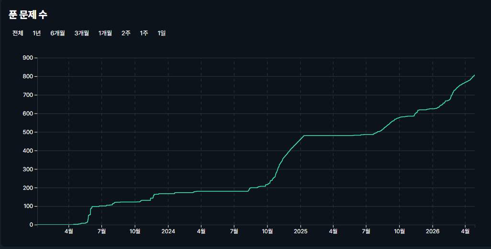
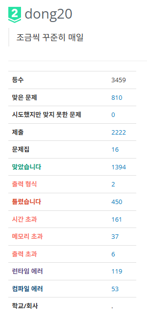
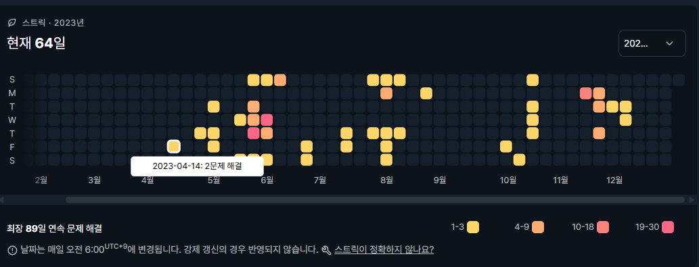
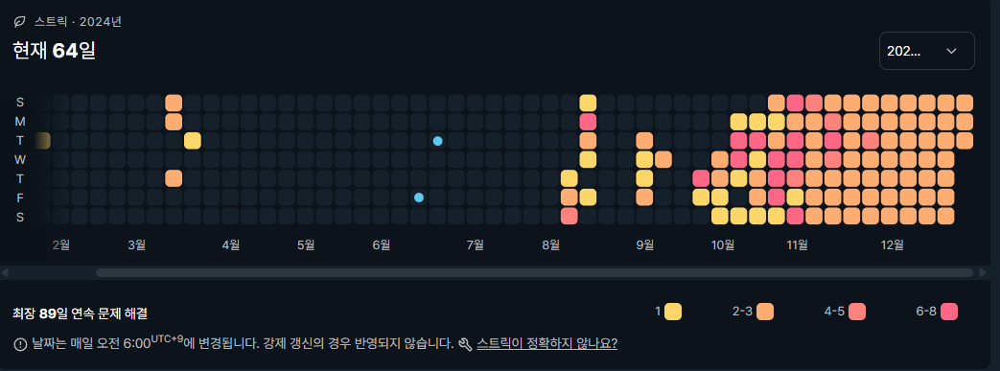
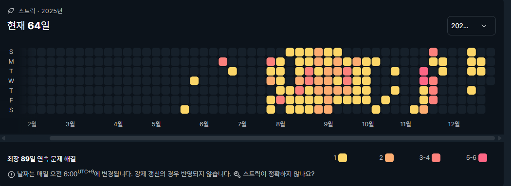
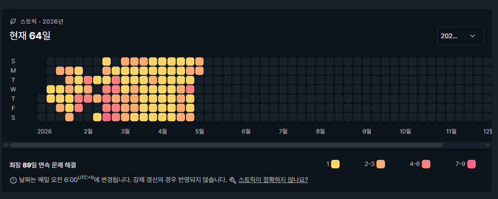

# 📂 BOJ Algorithm Archive (2023.04 - 2026.04)

## 1. 레포지토리의 용도 및 기록 목적
본 레포지토리는 2023년 4월 14일부터 2026년 4월 28일 백준 온라인 저지(BOJ) 서비스 종료 시점까지 진행한 1,111일간의 문제 해결 코드를 보관하는 아카이브입니다. 정답 코드 뿐만 아니라 오답 코드도 함께 백업하였으며, 알고리즘 풀이 과정에서 적용한 **Low-level 최적화(기계적 최적화)**와 트레이드오프(Trade-off)를 고민하며 성능 체크를 헀던 기록들을 파일로 남겼습니다.

<br>

## 2. 파일 구조 (Directory Structure)
```text
📦 ALGORITHM
 ┣ 📂 BaekJoon
 ┃ ┗ 📂 src
 ┃   ┣ 📂 BaekJoon
 ┃   ┃ ┗ 📜 BaekJoon_1005.java (문제 풀이 소스 코드) ...
 ┃   ┣ 📂 BJ_1162
 ┃   ┃ ┣ 📜 1162번_도로포장.pdf (문제 명세 아카이브)
 ┃   ┃ ┗ 📜 BJ_1162_103377262.java (제출 번호 기반 소스 코드)
 ┃   ┗ 📂 BJ_1199 ...
 ┣ 📂 BOJ_ARCHIVE
 ┃ ┗ 📂 2026
 ┃   ┣ 📂 01 ~ 03
 ┃   ┗ 📂 04
 ┃     ┗ 📂 0XXXX
 ┃       ┣ 📜 AC_XXXX_YYYYYYYYY.java (AC : 정답 코드, X : 문제 번호, Y : 제출 번호)
 ┃       ┣ 📜 problem_info.md (설계 근거 및 최적화 회고 명세)
 ┃       ┗ 📜 WA_XXXX_YYYYYYYYY.java (WA : 오답/실패 코드)
 ┣ 📂 BOJ_record (BOJ 기록 통계 이미지)
 ┗ 📜 README.md
```

<br>

## 3. 성장 곡선 (Growth Curve)


* **초기 (2023):** 브론즈/실버 위주의 기초 알고리즘 및 언어(Java) 적응
* **중기 (2024~2025):** 일일 골드 문제 해결 루틴 정착 및 블로그(Velog)를 통한 설계 논리 문서화
* **후기 (2026):** 전체 해결 문제의 **54.6%를 골드 이상** 난이도로 채우며 상위 1.47% (Platinum II) 도달

<br>

## 4. 기계적 최적화의 포인트 (Mechanical Sympathy)
Java 8 환경을 기준으로, 표준 라이브러리의 오버헤드를 줄이고 시스템 리소스를 극한으로 제어하는 방식을 지향했습니다. 공간 복잡도와 시간 복잡도의 밸런스를 조율하기 위해 객체 재사용, 비트 연산, 그리고 정교한 조건 분기를 핵심 설계 원칙으로 삼았습니다.

* **[메모리 최적화 및 연산 오버헤드 감소]**: 2차원 배열을 비트 패킹(Bit Packing)을 활용해 1차원 배열로 평탄화(Flattening)하여 객체 생성을 최소화하고, 사칙연산 대신 비트마스킹을 적용해 CPU 연산 오버헤드 단축
* **[조건 분기 최적화를 통한 성능 약 15% 개선]**: BOJ '오아시스 재결합' 
* **[조건 분기 최적화를 통한 성능 약 50% 개선]**: BOJ 'K번째 최단 경로'

<br>  

## 5. BOJ 종합 통계 (Statistics)
2,222회의 제출 과정에서 발생한 828회의 오답(시간/메모리 초과 등)은 한계 성능을 돌파하기 위한 벤치마킹 데이터로 활용되었습니다.



| 지표 | 상세 수치 | 비고 |
| :--- | :--- | :--- |
| **최종 티어** | **Platinum II** | RATING: 2,012 / Class 6 |
| **Solved.ac 랭킹** | **#2,762** | 상위 1.47% |
| **총 제출 수** | **2,222회** | 전체 여정의 총량 |
| **해결 문제 수** | **810개** | 순수 정답률 53% (중복 제외 시) |
| **최장 스트릭** | **89일** | 2026년 4월 28일 기준 65일 진행 중 종료 |

<br>

## 6. 연도별 분기점 요약 (Milestones)
* **2023년:** 알고리즘 기초 적응 및 스터디 병행 (브론즈 ~ 실버 문제 풀이)


* **2024년:** 골드 문제 풀이 및 **Platinum 등급 최초 달성 (12.25)**



* **2025년:** 논리적 한계 인식 후 Velog 기반 **'설계 및 회고' 문서화 도입**, PCCP Java Lv.4 취득 (2025.09.21)


* **2026년:** 삼성 SW 역량 테스트 B형(Professional) 취득 (2026.03.14) 및 AI 교차 검증을 통한 **극한의 메모리/분기 조건 최적화** 적용


<br>

## 7. 회고: 성능과 가독성의 트레이드오프 (Retrospective)
BOJ는 작성한 코드의 성능을 시간과 메모리라는 객관적인 지표로 즉각 증명할 수 있는 훌륭한 '검증의 장'이었습니다.

저는 단순히 "맞았습니다"라는 결과에 만족하지 않고, 성능의 임계점을 넘기 위해 치열하게 고민했습니다. 2차원 배열을 1차원으로 평탄화하거나 비트마스킹을 적용하는 등, 연산 오버헤드를 극한으로 줄이는 기계적 최적화(Mechanical Sympathy)를 적극적으로 실험했습니다. 하지만 이러한 극단적인 최적화는 성능을 획기적으로 끌어올리는 반면, 코드를 난해하게 만들어 가독성과 유지보수성을 심각하게 훼손한다는 명확한 한계(Trade-off)를 안고 있었습니다.

수많은 시행착오를 거치며, 실무적인 관점에서는 코드의 형태를 무너뜨리는 맹목적인 최적화보다 '로직과 조건 분기의 정교한 재설계'가 훨씬 가치 있는 접근임을 깨달았습니다. 실제로 '오아시스 재결합'이나 'K번째 최단 경로' 문제에서는 코드의 가독성을 온전히 유지하면서도, 조건 분기를 개선하는 것만으로 15%에서 최대 50%까지의 성능 향상을 이끌어냈습니다.

비록 플랫폼의 서비스는 종료되었으나, 이 과정에서 체득한 성능과 가독성 사이의 균형 감각, 그리고 시스템 리소스를 주도적으로 통제하는 습관은 앞으로 저의 엔지니어링에 있어 가장 든든한 기준이 될 것입니다.

<br>

## 8. 마무리 (Conclusion)
* **관련 프로젝트:** 사용자 맞춤 문제 추천 및 스터디 알림 도구 [BOJ Random Picker](https://github.com/DWinging/vibe-coding-boj) 기획 및 운영 (2026.04 종료)
* **상세 회고록:** 모든 최적화 과정과 기술적 고민의 흔적은 [Velog 포스팅](https://velog.io/@dong20)에서 확인하실 수 있습니다.
